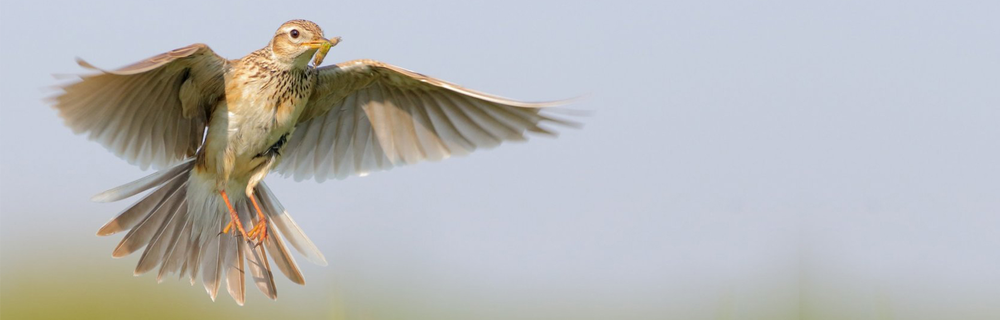

# How does a skylark sing?

#### Table of Contents:
1. [Artefact](#Artefact)
    1. [Metadata](#Metadata)
2. [Research](#Research)
    1. [The Audio - Ciocarlia](#The-Audio)
    2. [The Medium - Vinyl](#The-Medium)
3. [Transcodings](#Transcodings)
    1. [Analog to digital](#Transcoding-1)
    2. [Birds, forks and knives](#Transcoding-2)
    3. [A Soundscape](#Transcoding-3)
    4. [Bird, birds and other things that could have happended](#Transcoding-4)
    5. [What goes around comes around (Transcoding Tool)](#Transcoding-Tool)
4. [Reflection](#Reflection)
5. [Outcome](#Outcome)
6. [Conclusion](#Conclusion)

# Artefact

The object is a vinyl record, onto which is pressed a violin performance of "*Ciocarlia*" by Nicu Stanescu.

## Metadata
| Tag | Data |  
|--|--|
 **COLL00332** | [Link to collection](http://hdl.handle.net/10622/COLL00332)
| **Item Tag** | PK1-788
| **Physical Description** | A double sided vinyl record in a white paper cover with thin colored stripes.
| **Type** | Audio recording
| **Medium** | Vinyl record
| **Materials** | Vinyl, Paper, Plastic
| **Date** | 1990-2003
|    
 | It is part of a larger collection: "*Gramophone records from Europe from country’s such as Belgium, Denmark, England, France, Hungary, Italy, The Netherlands, Portugal, Russia, Spain and Sweden. Gramophone records consists of various music from Europe. It contains different types of genres such as Basque, pop music, cabaret, poetry, chansons, folk music from Alsace, Corse and Bretagne and Kurdish music.*" However this particular record is a romanian folk tune.

# Research
## The Audio 
The tune pressed onto the vinyl is called "*Ciocarlia*", it is itself a transcoding of a birds song to a musical score. There are diverse theories as to where it originates from but similar tunes are heard across the balkans and caucas. Below is an overview of some notabe interpreations, most are of romanian origin because the modern score that is recorded on the artifact is accredited to a Romainan-Gypsy musician. The tune is also part of the collective memory and identity of Romania. 

| Performer | Instrument | Relevancy | Link |
--|--|--|-- 
 **Nicu Stanescu** | Violin | This is the archived version. It seems to feature a recording of a performance from 1956, even though the vinyl record itself was pressed later. The lead performer was the founder of two well renowned romanian orchestras, one that focuses on folk music and another with an inclination to Lautari music with some overlap. Even though his performance of the Ciocarlia is neither his personal stand-out performance, nor the most renowed performance of Ciocarlia, given the popularity of both it explains why this version had such high chances of being archived and it was. |  
 **Grigoras Dinicu** |  Violin | As the most famous romanian-gypsy violinist his performnce of Ciocarlia is also the "default". He used the sheet music his grandfather, Anghelus Dincu, wrote pan-flute because it could showcase his impressive violin skills. He performed Ciocarlia in a number of European cities including London, Paris, Monte Carlo and Vienna. |  
 **Anghelus Dinicu** | Pan-Flute | The romainan-gypsy performer is credited for writing the sheet music for Ciocarlia. The tune was aso peformed by him on pan-flute at the 1889 World Art Fair in Paris, the innauguraton of the Eiffel Tower. | No online recording of the performance is available
 **Gheorghe Zamfir** | Pan-flute | A return to the instrument the sheet music was written for. Zamfir re-introduced the pan-flute as a notorious musical instrument, he applied it to numerous music genres shaping the romainan folk-rock movement for example. He was awarded the with the medal of Vatican, the French order of cultural merit, and kinghted by Frane, Belgium and Luxemburg for his musical contributions to culture. He is most notable for performing folk songs, among witch is Ciocarlia. | 
 **George Enescu** | Violin | Georges Enesco, is considered to be the greatest Romanian musician. He was a composer, violinist, pianist, conductor, and teacher. He considered himself first and foremost a composer, but too few of his own compositions retain relevancy compared to his legendary persona remebered and told by his students and fellow musicians such as  Brahms, Bartok, Strauss, Ravel, Debussy and Shostakovich. | 
 **Victor Copacinschi** | Ciambalom | Successful moldovian musician who embraced romanian folk music while living basarabia under communist rule witch opposed the native romaian folk and culture. His rendetion of Ciocarlia became more known recently since his daughter recieved a grammy in 2018 for "Best Chamber Music" and promoted this recording on her platform. | 
 **Sons of Cordillera** | Pan-flute | The Vinyl was pressed by the same company that pressed the archived version. It is a recording that can be found on musical streaming services yet little can be found about the interpreters. |
 **David Kipiani, Giorgi Tskhadadze, Malkhaz Qoiava** | Flute | Georgian performance of "Trolola", actually using the same sheet music as previous examples. |
  **Laza Tamburica** | Tambura | Serbian interpretation of "Seva" by local orchestra. Captures a more informal setting but still showcases great skill and talent. |
  
### The bird

It is a widespread species found across Europe and the Palearctic with introduced populations in New Zealand, Australia and on the Hawaiian Islands. It is a bird of open farmland and heath, known for the song of the male, which is delivered in hovering flight from heights of 50 to 100 metres (160 to 330 ft). The sexes are alike. It is streaked greyish-brown above and on the breast and has a buff-white belly.

The female Eurasian skylark builds an open nest in a shallow depression on open ground well away from trees, bushes and hedges. She lays three to five eggs which she incubates for around 11 days. The chicks are fed by both parents but leave the nest after eight to ten days, well before they can fly. They scatter and hide in the vegetation but continue to be fed by the parents until they can fly at 18 to 20 days of age. Nests are subject to high predation rates by larger birds and small mammals. The parents can have several broods in a single season.

## The Medium  
### Why Vinyl?

| Reason | Exapansion |
--|--
Awareness | This medium requiers more active listening and awareness of the circumstances and the recording. Letting a generated spotify playlist play borders on lack of action, while putting on a vinyl is a deliberate concious action.
Sound Quality |  Vinyl is able to reproduce really high fidelity sound, with little to no comression of the sound waves. There is a limit in volume both in the recording phase and the output, ironically this encouraged the preservation of the variety of ranges rather than aiming for a uniform loud record as was the tendency for CDs.
Tangible | It is physical, therfore sharebale and inheritable. It's physicality disqualifies points of discussion that are still debated about digital recordings, for example the gray area of inheriting purchased iTunes mp3 recordings.
Buying experience | Purchasing a new record comes with a hunt, and intention, it is a hobby and there is a community aspect to it too.

# Transcodings
Both the medium and the content are important in the exploration of transcodings. The artifact is a whole, while the transcodings explore parts of what interested me, deconstructing it without putting it back together, because the goal is not to recreate the artifact but to experience it. 

## Transcoding 1
### Analog to digital 
Unfortunately for all the reasons stated in [The Medium](#The-Medium) section above, in order to work with the content in a manageable way I had to first get a digital recording of the sound on it, transcoding it in the simplest way from it's analoge form to an mp3 recording. 
Later on I also dissected the first recording into parts, since because of the way it was made it was not just a duplication of the content, but had a narrative of its on containing other actions such as putting the vinyl on the bed, starting the output, etc. 

### Aims
To have a digital recording that I can go back to, replay, alter and work with.

### Method & Tool
It was done in a tiny chamber in the IISG with only the vinyl and me moving, a capsule where all attention is on one thing, the recording. The digital version was recorded on my phone. Also used my phone to record  the space.

### Results
| The Recording | The Recording in Segmented Pieces |
--|--
 | 

## Transcoding 2
### Birds, forks and kinves
The tune itself can be called a transcoding as it takes the song of a skylark, reinterprets it into sheet music and then a musician performs it, ultimately creating soundwaves. I want to recreate this process of taming the bird, making the song available at will through a set of instructions and a performer. Taking a bit further folk songs are part of a collective memory, they exist in the mind of the group and are not anyones property. Ciocarlia is known and cathegorized as a folk song, yet it has a known creator and the vinyl recording is a physical object that is owned.

### Aims
Taming the bird song once again but furthering the folk aspect, to make the tune available to all that wish to hear it, without the need to pay to hear someone else's interpretation of it or formally own a version of it.

### Method
Experimenting with kitchen utensils and other household objects to create similar sounds while recording the outcomes for documentation and research. Here are some of the outcomes in [a notion document cause it actually embeds mp3s.](https://www.notion.so/We-have-Ciocarlia-at-home-c67fc20c03634e2da95f7bf45e3bc930)

Since the goal is distributing the knowledge I've gained on how to perform the tune at home, i come to the part in the process where the sheet music is made. But since sheet music is a graphic language of it's own that limits the availabilty of knowledge I chose to detail this new DIY way to perform Ciocarlia in a more universal graphic language, some would argue the most widely understood one-images. By creating and distributing this sheet I make Ciocarlia _more_ of folk song as anyone with acesss to this information can make a skylark sing in their bedroom now. here is the first draft:
 
 

### Tool
forks, knives, bowls, glasses, spoon, shelves, paperclips & the almighty Adobe Photoshop.

### Results

## Transcoding 3
### A soundscape
On a vinyl record the soundwaves are recorded as a physical landscape that a turntable touches and recreates the sounds inscribed in it. 

### Aims
To offer control to the listener and make the listening an active choice while also  translate the physical aspect of the artifact into a satisfying digital environment

### Methods
From the perspective of a needle point the rings of the vinyl are hills and mountains, a huge concentric formation. I played around in Unity and made a world. Ideally there would be more to explore, artefacts that speak of other versions of the song, the tune's history or romanian gypsy cuture, but for now, it is what it is. 
 
 
 

### Tool 
Unity & Cinema4D

### Results
The final result is part of [The Outcome](#The-Outcome).
## Transcoding 4
### Birds, birds and other things that could have been
A possible transcoding was bringing back the actual bird and recompiling a version of the tune made without the middleman (the musician), a recording of birds seemingly singing the tune. It did not happen because sometimes things are better in your head or in the forest.

Another aspect is the soundscape, as a vinyl record the soundwaves are recorded as a physical landscape that a turntable touches and recreates the sounds inscribed in it. Again a possible transcoding was removing the turnatble from the porcess by creating a soundscape that you interpret by touch. No audible soundwaves are to be produced, only a story you read by pressing your fingers along the physical soundscape. Unfortunately, since this sculptural interpretation would have no audiance for the forseeable future since that would be higly unsanitary and unsafe in a pandemic, making such a thing seemed pointless. Also since presenting it to you through a scan or a photo or a video makes no sense since it nulls all relevant asspects of the possible thing.

The narrative heard in the tune also inspires a transcoding of it's own, as this recording seems to be a piece of program music. The high tempo of the tune made me think of an animated chase kind of like Tom & Jerry.

## Transcoding Tool
### What goes around comes around - Transcoding Tool
In the small room the record was spinning around, and around, and around, in a seemingly eternal loop. The information is read by going in circles on a vinyl, so why not in a browser? The pieces of the story are layed out on the platter, but can only be accessed by spinning.

### Method 
Well, the road was not straight. Found a couple of things: like a way to make an eternal lazy suzan of larks.
 
 
 

In a way it was perfect because the motion and the hypnotic effect was there, but not the control. Scouring the internat for a way to scroll on a different path seems developers are awesome people making things happen, so here is a like to [scrollPath](https://github.com/JoelBesada/scrollpath) a jQuery plugin for defining a custom path that the browser follows when scrolling. A gem. 

But lastly here is where the process led, with some of the code sourced from Simon Sweeney, here is a website that reveals its content in a circular manner, making the viewer purposefully move along the circle in order to follow along with the story. Firstly I used this environment to display the other transcodings, but a better use if the medium (as advised by Hannes Bernard) is to actualy show a story of its own not parts of the previous process.
 
 
 

### Tool
Html, Css, Javascript, JQuery, Sizzle.js, [scrollPath](https://github.com/JoelBesada/scrollpath)

### Results
The final Result is also part of [The Outcome](#The-Outcome).
# Reflection
# Outcome
# Conclusion
